# Distributed Microservices Architecture — Point of Sale Platform

A production-grade, resilient, and fully observable **point of sale (POS) microservices backend**
built in **Go (Golang)**. Retail workloads — identity, merchants, catalog, cashiers, orders, and
payments — are split across self-contained, independently deployable services that communicate
synchronously over **gRPC** and asynchronously over **Apache Kafka**, behind a unified **REST API
Gateway** (Echo + NGINX).

Analytical reads never hit the transactional tier: a **CQRS-style OLAP layer** powered by
**ClickHouse** is fed by `stats_writer` (a Kafka consumer with backfill bootstrapping) and served
by `stats_reader`, a gRPC analytics query service that returns monthly/yearly revenue, best-selling
products and categories, transaction success rates, and cashier performance.

Persistence is **database-per-bounded-context**: **five isolated PostgreSQL 17 clusters —
`pos_identity`, `pos_merchant`, `pos_catalog`, `pos_sales`, `pos_email` — each fronted by its own
PgBouncer pooler**. There is no shared database and no generic `DB_HOST`; a service can only ever
reach the cluster its context owns.

---

## Table of Contents

1. [Key Features](#key-features)
2. [Architecture Overview](#architecture-overview)
3. [Service Catalog](#service-catalog)
4. [Database Layer — PostgreSQL Cluster & PgBouncer](#database-layer--postgresql-cluster--pgbouncer)
5. [Internal Service Architecture](#internal-service-architecture)
6. [Data & Event Flow](#data--event-flow)
7. [OLAP Analytics Layer](#olap-analytics-layer)
8. [Observability Architecture](#observability-architecture)
9. [Deployment Architectures](#deployment-architectures)
10. [Technology Stack](#technology-stack)
11. [Getting Started](#getting-started)
12. [Port Map Registry](#port-map-registry)
13. [Justfile Reference](#justfile-reference)
14. [Workspace Directory Tree](#workspace-directory-tree)

---

## Key Features

| Domain | Capabilities |
| :--- | :--- |
| **Auth & Users** | Registration, login, stateless JWT access/refresh token lifecycle, password reset, OTP email verification, `GetMe` profile resolver |
| **Roles & RBAC** | Permission configuration, granular access control, sub-second permission evaluation cached in Redis; role↔user assignment now lives in its own `UserRoleService` |
| **Merchants** | Merchant onboarding, profile and business data, soft-delete/restore with full data restoration |
| **Categories** | Category CRUD, search, trash/restore flows, monthly sold-volume analytics |
| **Products** | Product catalog with name, price, category assignment, stock tracking, image upload, monthly sold-quantity analytics |
| **Cashiers** | Cashier accounts per merchant with monthly order/revenue performance analytics |
| **Orders & Order Items** | Cart-style order composition with line items and quantities, automatic total calculation, soft-delete/trash/restore audit records |
| **Transactions** | Payment settlement against orders (cash and others), change calculation, status tracking, monthly success-rate reports |
| **OLAP Analytics** | ClickHouse warehouse fed by `stats_writer` (Kafka consumer + backfill) and served by `stats_reader` (gRPC analytics) |
| **Email Worker** | Kafka-driven worker dispatching OTPs, login alerts, and merchant onboarding notices over SMTP |
| **Persistence** | Five PostgreSQL 17 clusters, one per bounded context, each behind a dedicated PgBouncer pooler |
| **Observability** | Prometheus + Grafana, Loki + Promtail, Jaeger + OpenTelemetry, Pyroscope continuous profiling, Node/Kafka/Postgres exporters, Alertmanager |
| **Deployment** | Docker Compose (full stack and infra-only), Kubernetes manifests with HPA, ArgoCD GitOps |

---

## Architecture Overview

Each service is a logical, decoupled Go binary inside `service/` with its own gRPC boundary. The
API Gateway is the only public edge: it authenticates the JWT, then translates REST/JSON into
downstream gRPC calls.

### Core Architecture Principles

- **Domain-Driven Boundary Isolation** — every service owns its database, cache, and logic. Cross-boundary database sharing is forbidden.
- **Database-per-Bounded-Context** — five physically separate PostgreSQL 17 instances isolate each context's data.
- **Dedicated PgBouncer Pooling** — each cluster is fronted by its own pooler (host ports `6432`–`6436`), so concurrent services cannot exhaust PostgreSQL sockets.
- **Clean Architecture** — `handler → service → repository`, wired in `apps/server.go`.
- **OLAP & CQRS** — OLTP writes go to the per-context PostgreSQL clusters; analytical reads go to ClickHouse via `stats_reader`.
- **Event-Driven Resilience** — Kafka decouples email delivery and stats materialization from the transactional path.
- **OTel Telemetry Integration** — trace IDs propagate from the REST edge through gRPC down to PostgreSQL and ClickHouse.

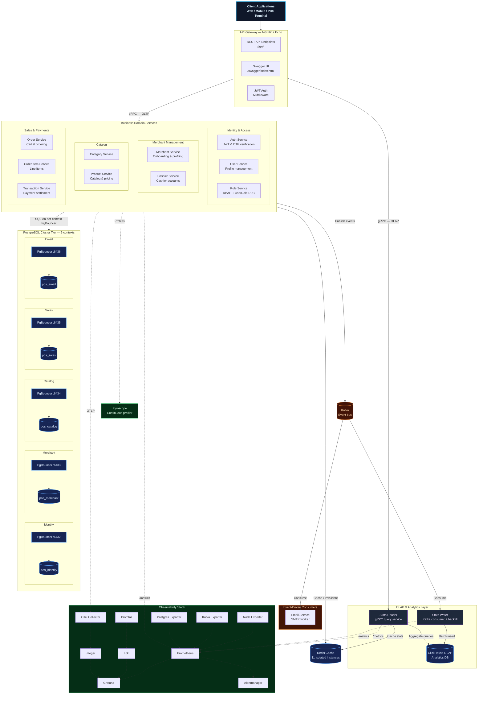

---

## Service Catalog

The workspace ships **11 domain services**, one REST API gateway, two OLAP workers, and two
operational jobs.

| # | Service | Bounded Context | gRPC | Metrics (HTTP) | Responsibility |
|---|---------|-----------------|------|----------------|----------------|
| 1 | `apigateway` | — | — | — (REST `:5000`) | REST/JSON edge, Swagger UI, JWT middleware, gRPC fan-out |
| 2 | `auth` | identity | `50051` | `8081` | Register, login, refresh, password reset, OTP |
| 3 | `role` | identity | `50052` | `8082` | Role CRUD + `UserRoleService` (assign / remove / find-by-user) |
| 4 | `user` | identity | `50053` | `8083` | User profiles, soft-delete/restore |
| 5 | `category` | catalog | `50054` | `8084` | Category CRUD, search, trash/restore |
| 6 | `cashier` | merchant | `50055` | `8085` | Cashier accounts per merchant |
| 7 | `merchant` | merchant | `50056` | `8086` | Merchant onboarding & profiling |
| 8 | `order_item` | sales | `50057` | `8087` | Order line items |
| 9 | `order` | sales | `50058` | `8088` | Cart checkout & order lifecycle |
| 10 | `product` | catalog | `50059` | `8089` | Product CRUD, stock, pricing |
| 11 | `transaction` | sales | `50060` | `8090` | Payment settlement & status |
| 12 | `email` | email | — | — | Kafka consumer → SMTP notifications |
| 13 | `stats_writer` | ClickHouse | — | — | Kafka consumer + backfill → ClickHouse |
| 14 | `stats_reader` | ClickHouse | — | — | gRPC analytics over ClickHouse |
| 15 | `migrate` | all | — | — | Migration runner across all five contexts |
| 16 | `seeder` | all | — | — | Development fixtures |

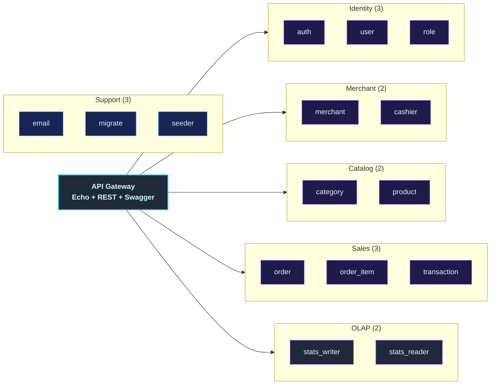

---

## Database Layer — PostgreSQL Cluster & PgBouncer

The POS platform runs **five independent PostgreSQL 17 clusters** — one per bounded context.
"Cluster" means *one dedicated PostgreSQL instance per context*, not a replicated
primary/replica pair. Isolation is the point: cross-context schema coupling becomes impossible,
blast radius stays small, and each context can be migrated and tuned independently.

**Every cluster is fronted by its own PgBouncer pooler.** Services dial the pooler, never
PostgreSQL itself, so the 11 concurrent services cannot exhaust server-side connections.

### Topology

| Bounded Context | PostgreSQL instance | Database | PgBouncer (host port) | Owning services |
| :--- | :--- | :--- | :--- | :--- |
| **Identity** | `postgres_identity` | `pos_identity` | `6432` | `auth`, `user`, `role` |
| **Merchant** | `postgres_merchant` | `pos_merchant` | `6433` | `merchant`, `cashier` |
| **Catalog** | `postgres_catalog` | `pos_catalog` | `6434` | `category`, `product` |
| **Sales** | `postgres_sales` | `pos_sales` | `6435` | `order`, `order_item`, `transaction` |
| **Email** | `postgres_email` | `pos_email` | `6436` | `email` |

> **Pool mode differs per environment** — this is intentional and worth knowing when debugging
> prepared-statement or session-state behaviour:
> - **Local (Docker Compose)**: `POOL_MODE=transaction`
> - **Kubernetes**: `POOL_MODE=session`, with `MAX_CLIENT_CONN=1000`, `DEFAULT_POOL_SIZE=20`,
>   `MAX_PREPARED_STATEMENTS=100`
>
> Auth is `scram-sha-256` in both.

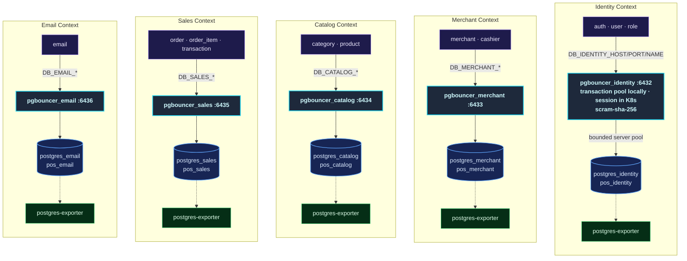

### Connection Lifecycle

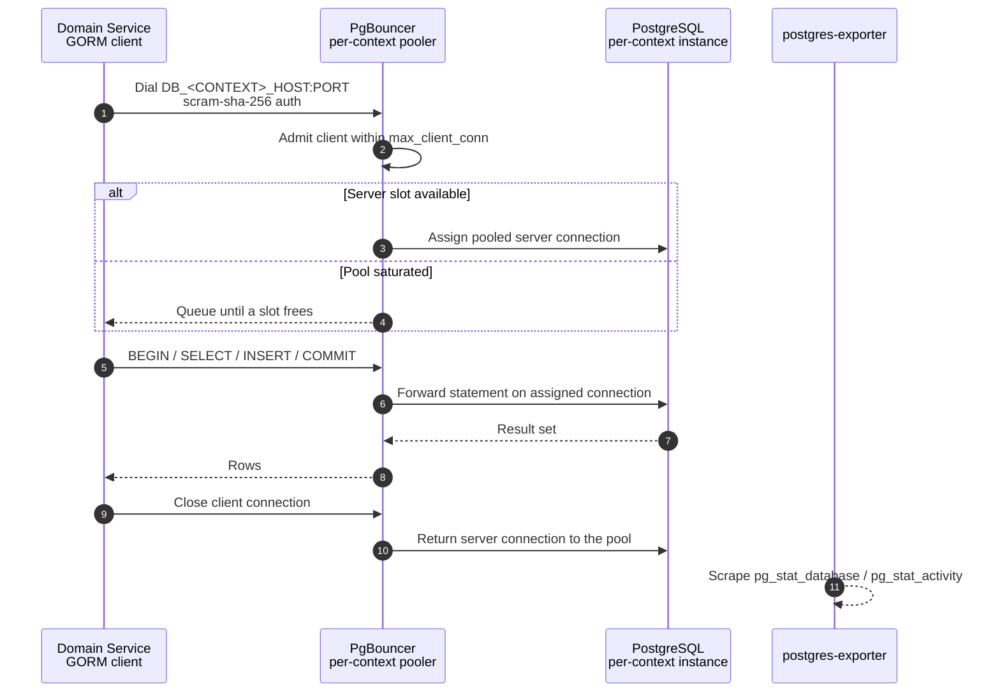

### Environment Contract

There is no generic `DB_HOST` / `DB_PORT` / `DB_NAME`. Each service declares its cluster once in
`service/<name>/cmd/main.go`:

```go
server.Config{
    DBCluster: "DB_IDENTITY", // → DB_IDENTITY_HOST / _PORT / _NAME
    // ...
}
```

`pkg/database/names.go` is the single source of truth and holds three coordinated maps:

| Symbol | Purpose |
| :--- | :--- |
| `IdentityDB` … `EmailDB` | Logical database names (`pos_identity` … `pos_email`) |
| `BoundedContexts` | Migration/seed order: `identity → merchant → catalog → sales`, `email` independent |
| `ContextPrefix` | `"identity" → "DB_IDENTITY"`, `"merchant" → "DB_MERCHANT"`, `"catalog" → "DB_CATALOG"`, `"sales" → "DB_SALES"`, `"email" → "DB_EMAIL"` |
| `ServiceContext` | `"cashier" → "merchant"`, `"transaction" → "sales"`, … — routes migrations and seed data to the right instance |

Each prefix resolves `<PREFIX>_HOST` / `<PREFIX>_PORT` / `<PREFIX>_NAME` (plus optional per-context
user/password), and those values point at the context's **PgBouncer** service — never at
PostgreSQL directly.

### Migration & Seed Order

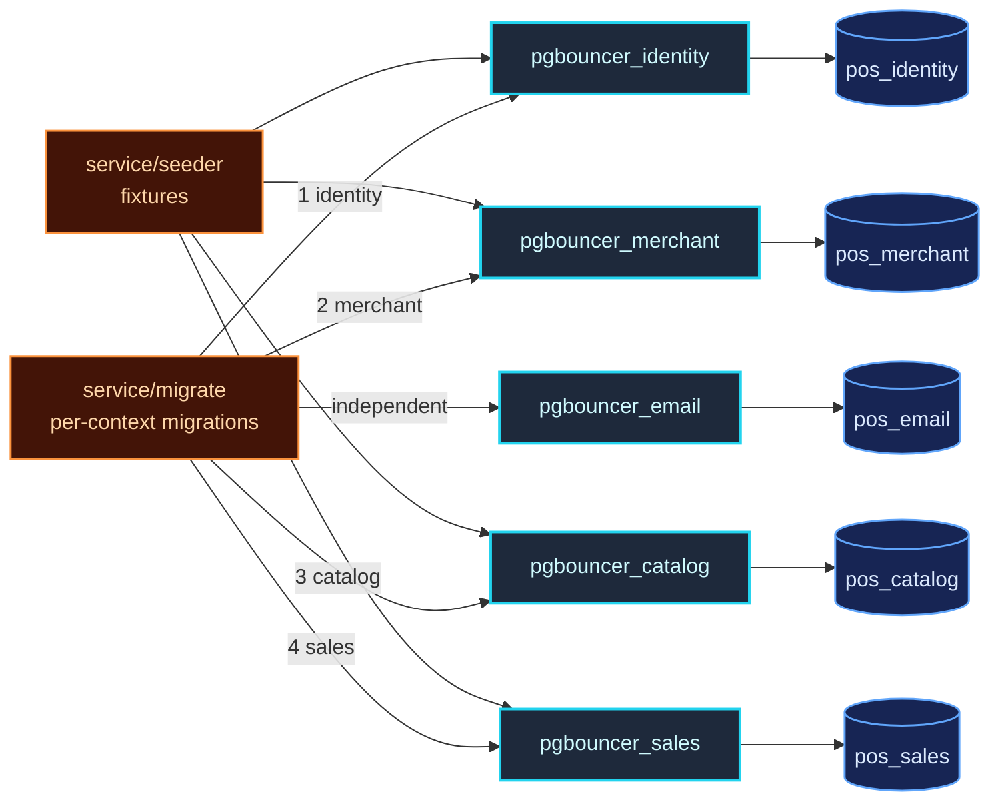

### Kubernetes Topology

In-cluster each context becomes a **StatefulSet + PVC** with a **Deployment** pooler in front, and
NetworkPolicies enforce who may talk to what:

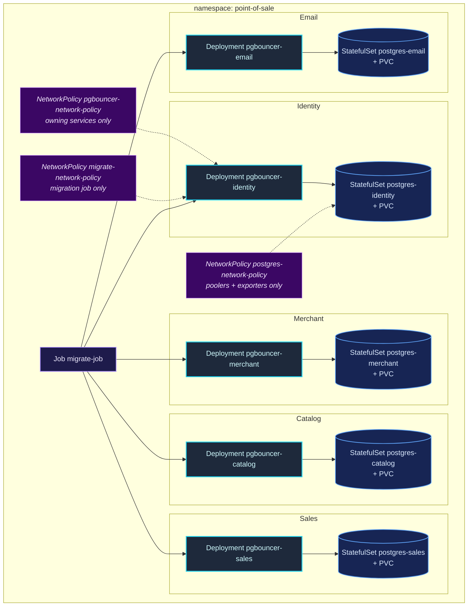

> PostgreSQL ports are not published to the host in either target — connect through PgBouncer
> (`6432`–`6436`).

---

## Internal Service Architecture

```mermaid
graph TB
    classDef handler fill:#1e3a5f,stroke:#7dd3fc,color:#e0f2fe,stroke-width:1.5px
    classDef service fill:#1e1b4b,stroke:#a78bfa,color:#ede9fe,stroke-width:1.5px
    classDef repo fill:#172554,stroke:#60a5fa,color:#dbeafe,stroke-width:1.5px
    classDef infra fill:#052e16,stroke:#4ade80,color:#dcfce7,stroke-width:1.5px
    classDef shared fill:#431407,stroke:#fb923c,color:#fed7aa,stroke-width:1.5px

    subgraph Service["service/<name>/"]
        direction TB

        CMD["cmd/main.go<br/>Entry point + DBCluster selection"]

        subgraph Internal["internal wiring"]
            direction TB
            APPS["apps/server.go<br/>Dependency injection"]:::handler
            HANDLER["handler/<br/>gRPC handlers"]:::handler
            MW["middleware/<br/>Interceptors"]:::handler
            SVC["service/<br/>Business logic"]:::service
            CACHE["cache/<br/>Redis cache layer"]:::service
            REPO["repository/<br/>Data access — GORM"]:::repo
        end

        CMD --> APPS
        APPS --> HANDLER
        APPS --> SVC
        APPS --> CACHE
        APPS --> REPO
        HANDLER --> SVC
        SVC --> REPO
        SVC --> CACHE
    end

    subgraph SharedLibs["shared/ — Shared Libraries"]
        direction LR
        DOMAIN["domain/<br/>record / request / response"]:::shared
        OBS["observability/<br/>cache & tracing metrics"]:::shared
        CACHESHARED["cache/<br/>redis_cache.go"]:::shared
        MAPPER["mapper/<br/>Domain ↔ Proto"]:::shared
        ERRORS["errors/ + errorhandler/"]:::shared
    end

    subgraph PkgLibs["pkg/ — Platform Libraries"]
        direction LR
        PKGAUTH["auth/<br/>JWT manager"]:::infra
        PKGKAFKA["kafka/<br/>Producer / consumer"]:::infra
        PKGOUTBOX["outbox/<br/>Transactional outbox helpers"]:::infra
        PKGOTEL["otel/<br/>Tracing + metrics init"]:::infra
        PKGRES["resilience/<br/>Circuit breaker, rate limiter,<br/>load monitor, DependencyGuard"]:::infra
        PKGLOG["logger/<br/>Zap structured logging"]:::infra
        PKGSRV["server/<br/>gRPC bootstrap"]:::infra
        PKGDB["database/<br/>Per-context GORM + names.go"]:::infra
        PKGCH["clickhouse/<br/>OLAP connection + schema"]:::infra
        PKGADAPTER["adapter/role · adapter/user_role<br/>guarded gRPC clients"]:::infra
    end

    PB["pb/<br/>Generated protobuf Go code"]:::shared
    PGB_EXT["PgBouncer per context"]:::infra

    REPO --> DOMAIN
    REPO --> PGB_EXT
    SVC --> DOMAIN
    SVC --> OBS
    HANDLER --> PB
    HANDLER --> MAPPER
    APPS --> PKGSRV
    APPS --> PKGOTEL
    APPS --> CACHESHARED
    APPS --> PKGADAPTER
    APPS --> OBS
```

### Cross-Context Access: the Adapter Pattern

`service/auth` and `service/user` need role data but must not open a second database connection.
They use typed gRPC adapters, each wrapped in a `DependencyGuard` (per-call timeout + circuit
breaker + bulkhead):

| Adapter | Package | Backing RPC | Used by |
| :--- | :--- | :--- | :--- |
| `RoleAdapter` | `pkg/adapter/role` | `RoleService` — `FindById`, `FindByName` | `service/auth`, `service/user` |
| `UserRoleAdapter` | `pkg/adapter/user_role` | `UserRoleService` — `FindByUserId`, `AssignRoleToUser`, `RemoveRoleFromUser` | `service/auth`, `service/apigateway` |

---

## Data & Event Flow

### Synchronous Flow — REST → gRPC → Redis → PgBouncer → PostgreSQL

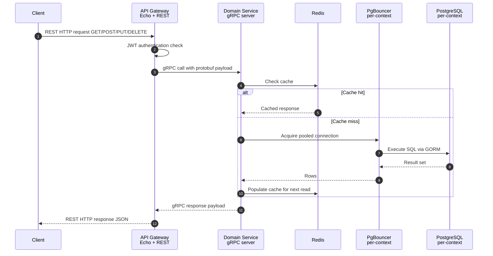

### Asynchronous Flow — Kafka Notification & Stats Pipeline

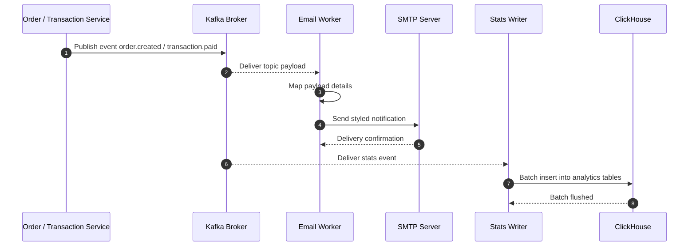

---

## OLAP Analytics Layer

Transactional writes land in the per-context PostgreSQL clusters; analytical reads are served by
ClickHouse through `stats_reader`, which the API Gateway calls with cache-aside Redis.

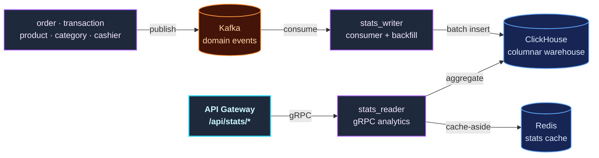

---

## Observability Architecture

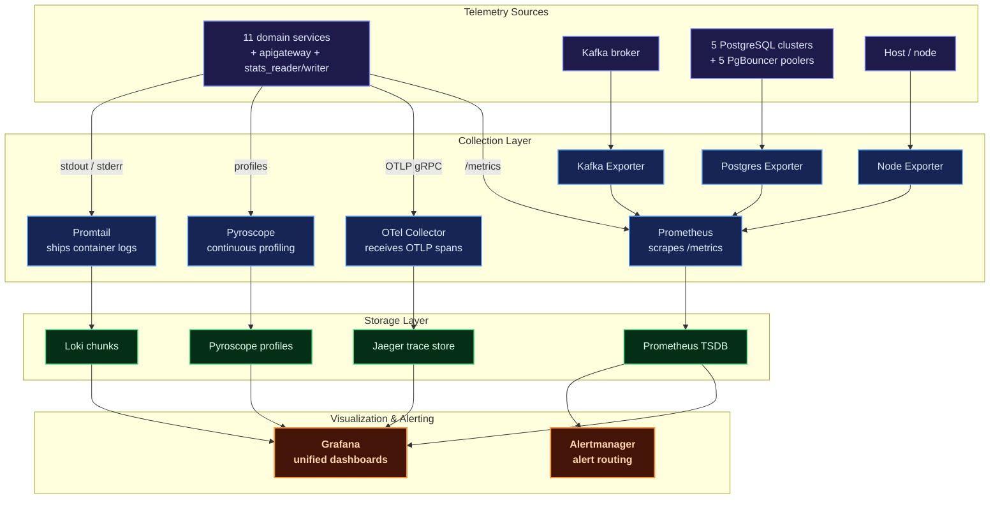

| Pillar | Tooling | What you get |
| :--- | :--- | :--- |
| **Metrics** | Prometheus + Grafana | CPU/memory, request error rates, gRPC latencies, database connection states |
| **Logging** | Loki + Promtail | Structured JSON indexed per service, queryable with LogQL |
| **Tracing** | OpenTelemetry + Jaeger | End-to-end traces across REST → gRPC → PostgreSQL / ClickHouse / Kafka |
| **Profiling** | Pyroscope | Continuous CPU/memory profiling to catch allocation leaks in transaction loops |
| **Alerting** | Alertmanager | Notifications on latency spikes and service disconnects |

---

## Deployment Architectures

### Docker Compose (Local Development)

Two compose files live under `deployments/local/`:

- **`docker-compose.yml`** — the whole platform: 5 PostgreSQL + 5 PgBouncer, 11 isolated Redis
  instances, ClickHouse, Kafka, Pyroscope, all Go services, and the observability stack.
- **`docker-compose.infra.yml`** — **infra-only** for native development: it boots just the
  5 PostgreSQL/PgBouncer pairs, Redis, Kafka, ClickHouse, and observability, publishing PgBouncer
  on host ports `6432`–`6436` so host-run binaries can reach their context.

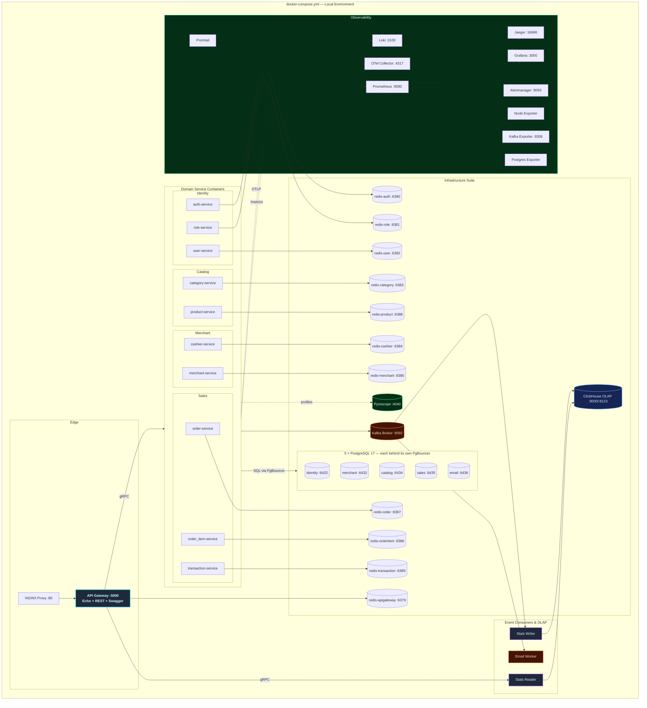

### Kubernetes (Production) + ArgoCD GitOps

Production runs in the `point-of-sale` namespace: one Deployment + Service + HPA per domain
service, one StatefulSet + PVC per PostgreSQL context, one Deployment per PgBouncer pooler, and
NetworkPolicies that enforce "only the owning context may connect". Delivery is GitOps-driven via
ArgoCD (`deployments/gitops/argocd/`) with base/overlay manifests under
`deployments/kubernetes/overlays/`.

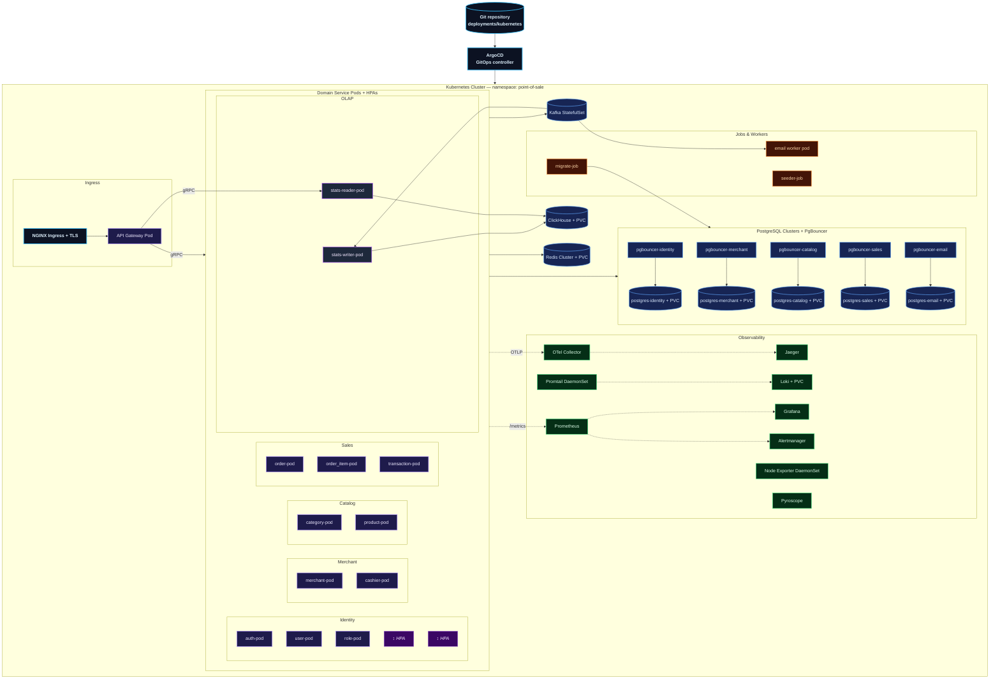

---

## Technology Stack

| Category | Technology | Purpose |
| :--- | :--- | :--- |
| **Language** | Go (Golang) | High-performance compiled concurrent backend |
| **API Edge Gateway** | Echo (REST) | REST API gateway with auto-generated Swagger UI |
| **RPC Inter-service** | gRPC + Protobuf | Contract-first synchronous communication |
| **OLTP Database** | PostgreSQL 17 ×5 | Database-per-bounded-context: `pos_identity`, `pos_merchant`, `pos_catalog`, `pos_sales`, `pos_email` |
| **Connection Pooler** | PgBouncer ×5 | One pooler per cluster — `transaction` mode locally, `session` in K8s — host ports `6432`–`6436` |
| **OLAP Database** | ClickHouse | Columnar warehouse for analytics aggregations |
| **ORM** | GORM | Object-relational mapping & query builder |
| **DB Migrations** | Goose | Per-context incremental schema versioning |
| **Caching Tier** | Redis | 11 isolated Redis instances, one per service |
| **Messaging Stream** | Apache Kafka | Asynchronous high-throughput event bus |
| **Token Manager** | JWT | Stateless authentication & authorization |
| **Observability** | OpenTelemetry + Jaeger | Vendor-neutral telemetry pipeline and visualization |
| **Metrics / Dashboards** | Prometheus + Grafana | Scraping, dashboards, and alert rules |
| **Log Aggregation** | Loki + Promtail | Centralized structured log storage and shipping |
| **Continuous Profiler** | Pyroscope | Real-time CPU/memory profiling |
| **Alerting** | Alertmanager | Alert routing & notification dispatch |
| **Reverse Proxy** | NGINX | Edge routing and TLS termination |
| **Containerization** | Docker + Docker Compose | Local orchestration |
| **Orchestrator** | Kubernetes + HPA | Production auto-scaling pod infrastructure |
| **GitOps** | ArgoCD | Declarative continuous delivery |
| **Resilience** | `pkg/resilience` | Circuit breaker, rate limiter, load monitor, `DependencyGuard` |

---

## Getting Started

### Prerequisites

- [Git](https://git-scm.com/)
- [Go](https://go.dev/) (v1.23+)
- [Docker](https://www.docker.com/) & [Docker Compose](https://docs.docker.com/compose/)
- [Just Task Runner](https://github.com/casey/just)
- [Protobuf Compiler](https://grpc.io/docs/protoc-installation/) (for codegen updates)

### 1. Clone the Workspace

```sh
git clone https://github.com/MamangRust/monolith-pointofsale-grpc.git
cd monolith-pointofsale-grpc
```

### 2. Prepare Environment Configurations

Environment files are tracked in the repository — no copy step required:

- `.env` — root variables for native (non-containerized) service runs
- `deployments/local/docker.env` — variables injected into Compose containers

The PostgreSQL cluster contract lives there:

```dotenv
# Host = the context's PgBouncer service, never PostgreSQL itself
DB_IDENTITY_HOST=pgbouncer_identity
DB_IDENTITY_PORT=5432
DB_IDENTITY_NAME=pos_identity

DB_SALES_HOST=pgbouncer_sales
DB_SALES_PORT=5432
DB_SALES_NAME=pos_sales
```

For native runs against `docker-compose.infra.yml`, point hosts at `localhost` and ports at the
published pooler ports `6432`–`6436`.

### 3. Start Local Environment

```sh
just build-up      # build images and boot the Compose stack
just migrate       # run migrations across all five contexts
just seeder        # optional: development fixtures
just ps            # verify health and ports
```

**Native development** (services from `bin/`, only infrastructure containerized):

```sh
just infra-up      # 5 PostgreSQL/PgBouncer pairs, Redis, Kafka, ClickHouse, observability
just services-up   # build binaries and start services locally
```

### 4. Access Services

| Service | URL |
| :--- | :--- |
| Swagger UI | [http://localhost/swagger/index.html](http://localhost/swagger/index.html) |
| REST API Gateway Edge | [http://localhost/api/*](http://localhost/api/*) |
| API Gateway Direct | [http://localhost:5000](http://localhost:5000) |
| Grafana | [http://localhost:3000](http://localhost:3000) (`admin`/`admin`) |
| Prometheus | [http://localhost:9090](http://localhost:9090) |
| Jaeger | [http://localhost:16686](http://localhost:16686) |
| Pyroscope | [http://localhost:4040](http://localhost:4040) |
| Loki | [http://localhost:3100](http://localhost:3100) |

```sh
just down
```

---

## Port Map Registry

| Application / Service | Port / URL |
| :--- | :--- |
| **auth** gRPC / metrics | `localhost:50051` / `localhost:8081` |
| **role** gRPC / metrics | `localhost:50052` / `localhost:8082` |
| **user** gRPC / metrics | `localhost:50053` / `localhost:8083` |
| **category** gRPC / metrics | `localhost:50054` / `localhost:8084` |
| **cashier** gRPC / metrics | `localhost:50055` / `localhost:8085` |
| **merchant** gRPC / metrics | `localhost:50056` / `localhost:8086` |
| **order_item** gRPC / metrics | `localhost:50057` / `localhost:8087` |
| **order** gRPC / metrics | `localhost:50058` / `localhost:8088` |
| **product** gRPC / metrics | `localhost:50059` / `localhost:8089` |
| **transaction** gRPC / metrics | `localhost:50060` / `localhost:8090` |
| **PgBouncer — identity** (`pos_identity`) | `localhost:6432` |
| **PgBouncer — merchant** (`pos_merchant`) | `localhost:6433` |
| **PgBouncer — catalog** (`pos_catalog`) | `localhost:6434` |
| **PgBouncer — sales** (`pos_sales`) | `localhost:6435` |
| **PgBouncer — email** (`pos_email`) | `localhost:6436` |
| **Redis — apigateway / auth / role / user** | `6379` / `6380` / `6381` / `6382` |
| **Redis — category / cashier / merchant** | `6383` / `6384` / `6385` |
| **Redis — orderitem / order / product / transaction** | `6386` / `6387` / `6388` / `6389` |
| **Kafka Broker** | `localhost:9092` (internal) / `localhost:29092` (host) |
| **ClickHouse native / HTTP** | `localhost:9000` / `localhost:8123` |

> PostgreSQL is **not** published to the host — connect through the PgBouncer ports above.

---

## Justfile Reference

| Recipe | Scope |
| :--- | :--- |
| `just build-up` | Rebuild service images and launch Compose |
| `just up` | Launch Compose without rebuilding |
| `just down` | Stop Compose stacks and release networks |
| `just ps` | Health, uptime, and mapped ports |
| `just migrate` | Run migrations across all five bounded contexts |
| `just migrate-down` | Roll back the latest migration |
| `just seeder` | Populate mock users, roles, merchants, products, cashiers |
| `just generate-proto` | Compile `.proto` into Go models |
| `just generate-swagger` | Regenerate OpenAPI/Swagger specs |
| `just build` | Compile all services into `bin/` |
| `just build-image` | Build Docker images for all Compose services |
| `just image-load` | Load built images into a local minikube cluster |
| `just infra-up` / `infra-down` / `infra-ps` | Boot/stop the infra-only stack (5 PostgreSQL/PgBouncer pairs, Redis, Kafka, ClickHouse, observability) |
| `just services-up` / `services-down` | Start/stop local service binaries against the infra stack |
| `just e2e-hurl` | Full E2E suite: infra up → migrate → seed → services → hurl checks |
| `just smoke-trace` | Verify trace_id continuity across HTTP → gRPC → Kafka → email via Jaeger |
| `just smoke-stack-lifecycle yes` | Infra lifecycle test: clean volume start, restart/stop/start, no data loss |
| `just tidy-all` | `go mod tidy` across all modules |
| `just test-unit` | Unit tests under `pkg/` |
| `just test-integration` | Integration tests under `tests/` |
| `just test-all` | Unit + integration |

---

## Workspace Directory Tree

```
monolith-pointofsale-grpc/
├── proto/                          # Protobuf contracts
│   ├── role.proto                  #   Role query specifications
│   ├── user_role.proto             #   UserRole assignment specifications
│   └── ...                         #   auth, user, merchant, category, product,
│                                   #   cashier, order, order_item, transaction, stats
├── pb/                             # Compiled protobuf outputs
├── shared/                         # Consolidated workspace module
│   ├── domain/                     #   Domain models & requests
│   ├── mapper/                     #   Proto ↔ Go converters
│   ├── cache/                      #   Redis caching wrappers
│   ├── observability/              #   Cache/tracing interceptors
│   ├── errors/                     #   Error templates
│   └── errorhandler/               #   Error handling utilities
├── pkg/                            # Platform libraries module
│   ├── adapter/                    #   Guarded gRPC adapters (role, user_role)
│   ├── auth/                       #   JWT utilities
│   ├── database/                   #   Per-context GORM + names.go (cluster constants)
│   ├── clickhouse/                 #   OLAP connection + schema bootstrap
│   ├── kafka/                      #   Kafka producer/consumer
│   ├── outbox/                     #   Transactional outbox helpers
│   ├── redis/                      #   Redis connectors
│   ├── resilience/                 #   Circuit breaker, rate limiter, load monitor
│   ├── server/                     #   gRPC bootstrap
│   ├── otel/                       #   Telemetry hooks
│   └── logger/                     #   Zap structured logging
├── service/                        # Business domains
│   ├── apigateway/                 #   REST API gateway (Echo)
│   ├── auth/ user/ role/           #   Identity context
│   ├── merchant/ cashier/          #   Merchant context
│   ├── category/ product/          #   Catalog context
│   ├── order/ order_item/          #   Sales context
│   │   transaction/
│   ├── stats-writer/               #   Kafka → ClickHouse (OLAP write)
│   ├── stats-reader/               #   ClickHouse → gRPC (OLAP read)
│   ├── email/                      #   Kafka notification worker
│   ├── migrate/                    #   Per-context migration runner
│   └── seeder/                     #   Development seeder
├── deployments/
│   ├── local/                      #   docker-compose.yml + docker-compose.infra.yml
│   ├── kubernetes/                 #   Base + overlays, database, cache, messaging,
│   │                               #   networking, observability, security, HPAs
│   └── gitops/argocd/              #   ArgoCD project, root app, production app
├── observability/                  #   Prometheus, Loki, OTel, Promtail, alert rules
├── nginx/                          #   Reverse-proxy edge rules
├── redis/                          #   Redis configuration
├── tests/                          #   Integration tests, hurl E2E, smoke scripts
├── scripts/                        #   Helper shell scripts
├── uploads/                        #   Uploaded product images
└── images/                         #   Architecture diagrams
```

---

## License

This project is open-sourced under the MIT License for educational and development purposes.

---

<p align="center">
  Built with Go, gRPC, Apache Kafka, ClickHouse OLAP, PostgreSQL clusters behind PgBouncer, and a passion for high-performance point of sale microservices.
</p>
